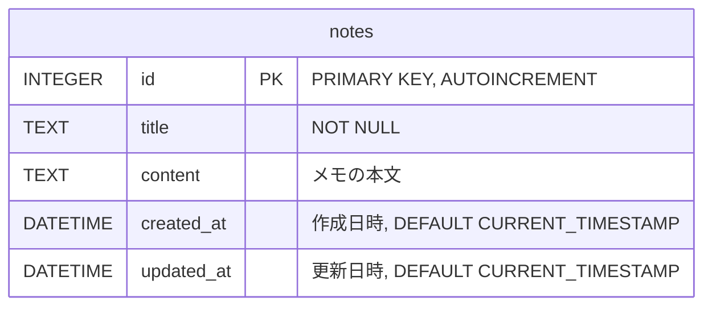

# 自分用メモアプリ開発企画書

## 1. 概要

### 1.1. プロジェクト名

ai-MyNotes

### 1.2. 目的

既存のメモアプリでは満たせない、個人的な思考フローや情報整理のスタイルに最適化された、シンプルかつ高速な自分専用のメモアプリケーションを開発する。開発プロセスを通じて、新しい技術の習得やソフトウェア設計のスキル向上も目指す。

### 1.3. ターゲットユーザー

自分自身。

### 1.4. 解決したい課題

*   **既存アプリの不満点:**
    *   多機能すぎて動作が重い、またはUIが複雑。
    *   不要な機能が多く、画面がごちゃごちゃしている。
    *   シンプルなアプリだと、Markdown対応やタグ付けなど、欲しい機能が足りない。
    *   特定のサービスにロックインされたくない。データはローカルで管理したい。

## 2. コンセプト

**「思考を妨げない、ミニマルで高速なメモ環境」**

*   **高速起動・高速動作:** アプリを開いてすぐに書き始められる軽快さを最優先する。
*   **シンプルなUI:** 必要な機能だけに絞り込み、直感的に操作できるUIにする。
*   **キーボード中心の操作:** マウス操作を極力減らし、キーボードショートカットで快適に操作できるようにする。
*   **拡張性:** まずは最小限の機能で始め、必要に応じて自分で機能を追加・改善できる設計にする。

## 3. 機能要件

### 3.1. MVP (Minimum Viable Product) 機能

まずは以下のコア機能に絞って開発する。

*   **メモのCRUD操作:**
    *   新規作成 (Create)
    *   内容の編集 (Update)
    *   一覧からの削除 (Delete)
*   **メモ一覧表示:**
    *   作成日時でソートされたメモのリストを表示する。
*   **リアルタイム保存:**
    *   入力中に自動で内容が保存される。
*   **全文検索:**
    *   すべてのメモを対象に、キーワードで高速に検索できる。
*   **データ永続化:**
    *   アプリを閉じてもメモが消えないように、ローカルDBに保存する。

### 3.2. 将来的に実装したい追加機能

*   **Markdownサポート:**
    *   見出し、リスト、太字、コードブロックなどのMarkdown記法に対応し、リアルタイムプレビューも表示する。
*   **タグ機能:**
    *   メモに複数のタグを付け、タグで絞り込み検索ができるようにする。
*   **カテゴリ分け:**
    *   メモを階層構造で管理できるようにする。
*   **ダークモード:**
    *   目に優しいダークテーマに切り替えられるようにする。
*   **チェックリスト機能:**
    *   `[ ]` や `[x]` でタスク管理ができるようにする。
*   **画像添付:**
    *   メモ内に画像をドラッグ＆ドロップで貼り付けられるようにする。

## 4. 技術スタック

### 4.1 プラットフォーム
*   **モバイルアプリ:**
    *   **iOS:** Dart / Flutter / XCode
    *   **Android:** Dart / Flutter / Android Studio

### 4.2 データ保存
*   **データベース**
    *   SQLite

### 4.3 ネットワーク、クラウド
*   ネットワークやクラウドは利用しないローカルアプリ

### 4.4 コーディングルール
*   クラス名はパスケルケース
*   変数名、メソッド名、関数名はキャメルケース
*   定数名は大文字
*   メソッド、関数のサイクロマティック複雑度は10以下とする
*   if文、while文のネストは極力避ける
*   switch文は極力使用しない

### 4.5 プログラム階層
*   3階層構成
    *   **インタフェースレイヤー**: UI/UXを担当
    *   **ドメインレイヤー**: 機能を構成
    *   **データベースレイヤー**: データベースの操作
*   データは Value Object に集約

### 4.6 開発環境
*   **開発マシン**: macbook air / macos
*   **コンパイラ**
    *   **iOS**: XCode
    *   **Android**: Android Studio
*   **テスト環境**
    *   **iOS**: XCode simulator
    *   **Android**: Android Studio　simulator

### 4.7 テスト
*   **単体テスト**: Dart テスト　メソッド単位にテスト実施
*   **実装テスト**: シュミレーター実行　担当者が動作確認実施

### 4.8 テーブル設計

拡張機能に必要なテーブルは随時追加する

#### テーブル構造の説明
##### notes テーブル
- id: 主キー（PRIMARY KEY）、自動インクリメント
- title: メモのタイトル（必須項目）
- content: メモの本文内容
- created_at: 作成日時（デフォルト値：現在時刻）
- updated_at: 更新日時（デフォルト値：現在時刻）

##### データ型と制約
- INTEGER: 整数型
- TEXT: テキスト型
- DATETIME: 日時型
- NOT NULL: 必須項目
- DEFAULT CURRENT_TIMESTAMP: デフォルト値として現在時刻を設定

## 5. 画面設計

*   **メモ編集画面**
    *   最上部に「戻り」ボタンを配置
    *   1行目をタイトルとして自動認識する
    *   2行目以降を自由編集する
    *   日本語入力を有効にする
*   **メモ一覧画面**
    *   メモを作成日時、降順で表示する
    *   **表示項目**
        *   タイトル：太字で表示
        *   内容：2行だけ表示
        *   作成日時
    *   メモをタップすると**メモ編集画面**に切り替わる

## 6. 開発スケジュール（目安）

*   **フェーズ1 :** 環境構築とMVP機能の実装
    1.  技術選定
    1.  プロジェクトセットアップ
    1.  メモのCRUD
    1.  一覧表示
    1.  ローカル保存機能の実装
*   **フェーズ2 :** 基本機能の改善
    1.  全文検索機能の実装
    1.  リアルタイム保存
*   **フェーズ3 :** 追加機能の実装と継続的改善
    1.  Markdownサポートの実装
    1.  タグ機能、UI/UXの改善など、使ってみて欲しくなった機能を順次追加していく。

## 7. リスクと対策

*   **リスク:** 開発のモチベーションが続かない。
    *   **対策:**
        *   完璧を目指さず、まずは動くものを作る（MVP）。
        *   開発ログやブログで進捗を記録し、達成感を可視化する。
        *   小さな目標（マイルストーン）を設定してクリアしていく。
*   **リスク:** データ損失の可能性。
    *   **対策:**
        *   堅牢なローカル保存の仕組みを構築する。
